# Apex Stopwatch


Apex Stopwatch is a lightweight library to accurately measure elapsed time.
Can be used for benchmarks in code optimization.

Inspired by [C# Stopwatch](https://learn.microsoft.com/en-us/dotnet/api/system.diagnostics.stopwatch).

## Table of Contents
- [Apex Stopwatch](#apex-stopwatch)
    * [Installation](#installation)
    * [Key Features](#key-features)
    * [Get Started](#get-started)
        + [CpuTimeStopwatch vs. CurrentTimeStopwatch](#cputimestopwatch-vs-currenttimestopwatch)
        + [Measure a Single Interval](#measure-a-single-interval)
        + [Measure Multiple Intervals](#measure-multiple-intervals)
        + [Stopwatch State](#stopwatch-state)
        + [Check the Elapsed Time](#check-the-elapsed-time)
        + [Reset and Restart a Stopwatch](#reset-and-restart-a-stopwatch)
        + [Resolution](#resolution)
        + [Performance](#performance)
    * [Examples](#examples)
    * [Disclaimer](#disclaimer)
    * [Documentation](#documentation)


## Installation

<a href="https://githubsfdeploy.herokuapp.com?owner=berehovskyi&repo=apex-stopwatch&ref=main">
  
</a>

or install as an Unlocked Package using the CLI:

```sh
sf package install -p 04t1t000003HVXnAAO -o me@example.com -r -w 3
```

## Key Features

- The `Stopwatch` class that is designed to measure the duration of a single interval
  or the cumulative duration over multiple intervals and its implementations:
    - `CpuTimeStopwatch`.
    - `CurrentTimeStopwatch`.

## Get Started

### CpuTimeStopwatch vs. CurrentTimeStopwatch

- The `CpuTimeStopwatch` is typically used to measure the CPU time (in milliseconds) that has been used
  in the current transaction based on the `Limits.getCpuTime` timestamps.
- The `CurrentTimeStopwatch` is typically used to measure the elapsed time (in milliseconds) based on
  the `System.currentTimeMillis` timestamps. Database operations, e.g. the portion of execution time spent
  in the database for DML, SOQL, and SOSL isn’t counted, nor is waiting time for Apex callouts.

Although Salesforce has a timeout limit for transactions based on CPU usage, sometimes it is useful to analyze 
the overall performance of Apex code finding the performance issues to optimize the user experience.

In Apex there are other methods such as `System.now`, `Datetime.now` that can return current timestamps, but
they always return the same result as `System.currentTimeMillis` does.

### Measure a Single Interval

To measure a single interval a new Stopwatch instance should be created, the `start` method is used
to start the Stopwatch and the `stop` method is used to stop the measuring process.
The elapsed time can be reviewed using the `elapsed` property.

```apex
// Instantiate a new CpuTimeStopwatch object
final Stopwatch sw = new CpuTimeStopwatch();
// Start the timer
sw.start();

// Or do both in a single call
final Stopwatch sw = CpuTimeStopwatch.startNew();

// Invoke the piece of code that is being measured
SomeClass.foo();

// Stop the timer
sw.stop();

// Get the measured CPU time, in milliseconds
final Long elapsedMillis = sw.elapsed;
```



```mermaid
---
displayMode: compact
---
gantt
    dateFormat  x
    axisFormat %L

    section Stopwatch
        start: active, t1, -1, 0
        stop: active, t3, after t2, 10

    section SomeClass
        foo: crit, t2, after t1, 9
```

### Measure Multiple Intervals

Measuring multiple time intervals can be achieved by repeatedly utilizing the `start`/`stop` methods.
Each call to `start` is initiated from the point of cumulative elapsed time,
while each call to `stop` concludes the current interval measurement and solidifies
the cumulative elapsed time value. The `elapsed` property value of a Stopwatch instance, by default,
equals **the sum of all the measured time intervals**.

```apex
// Instantiate a new CpuTimeStopwatch object
final Stopwatch sw = new CpuTimeStopwatch();

// Start the timer
sw.start();

// Invoke the piece of code that is being measured
SomeClass.foo();

// Stop the timer
sw.stop();

// Invoke the piece of code that is not being measured
SomeClass.ignoredInvocation();

// Start the timer again
sw.start();

// Invoke the piece of code that is being measured
SomeClass.bar();

// Stop the timer
sw.stop();

// Get the cumulative measured CPU time, in milliseconds
final Long elapsedMillis = sw.elapsed;
```



```mermaid
---
displayMode: compact
---
gantt
    dateFormat  x
    axisFormat %L

    section Stopwatch
        start: active, t1, -1, 0
        stop: active, t3, after t2, 11
        start: active, t5, after t4, 19
        stop: active, t7, after t6, 31

    section SomeClass
        foo: crit, t2, after t1, 10
        ignoredInvocation: done, t4, after t3, 18
        bar: crit, t6, after t5, 30
```

### Stopwatch State

A Stopwatch instance can either be in a **running** or a **stopped** state.
The current state can be verified using the `isRunning` property.

```apex
// Instantiate a new CpuTimeStopwatch object
final Stopwatch sw = new CpuTimeStopwatch();

// Check the state of the timer
Boolean isRunning = sw.isRunning; // false

// Start the timer
sw.start();

// Check the state of the timer
isRunning = sw.isRunning; // true

// Invoke the piece of code that is being measured
SomeClass.foo();

// Check the state of the timer
isRunning = sw.isRunning; // true

// Stop the timer
sw.stop();

// Check the state of the timer
isRunning = sw.isRunning; // false

// Get the measured CPU time, in milliseconds
final Long elapsedMillis = sw.elapsed;
```

### Check the Elapsed Time

The elapsed time can be obtained through the `elapsed` property.
This property can be accessed regardless of whether the Stopwatch is **running** or **stopped**.
The values of the property continue to increase when the Stopwatch is **operational**
and remain constant when it's **stopped**.

```apex
// Instantiate a new CpuTimeStopwatch object
final Stopwatch sw = new CpuTimeStopwatch();

// Check the elapsed time
final Long elapsedMillis = sw.elapsed; // 0

// Start the timer
sw.start();

// Check the current elapsed time
elapsedMillis = sw.elapsed; // 1

// Invoke the piece of code that is being measured
SomeClass.foo();

// Check the current elapsed time
elapsedMillis = sw.elapsed; // 9

// Stop the timer
sw.stop();

// Check the elapsed time between `start` and `stop`
elapsedMillis = sw.elapsed; // 10
```

### Reset and Restart a Stopwatch

The cumulative elapsed time in an existing Stopwatch instance can be cleared
using the `reset` method. The `restart` is the convenience method
for replacing `reset` and `start` with a single call.

```apex
// Instantiate a new CpuTimeStopwatch object and start the timer
final Stopwatch sw = CpuTimeStopwatch.startNew();

// Invoke the piece of code that is being measured
Boolean isSuccess = SomeClass.foo();

// Conditionally reset and start/restart the timer
if (isSuccess) {
    sw.reset();
    sw.start();
    // Or simply
    sw.restart();
}

// Invoke the piece of code that is being measured
SomeClass.bar();

// Stop the timer
sw.stop();

// Get the measured CPU time, in milliseconds
final Long elapsedMillis = sw.elapsed;
```

### Resolution

The resolution of the Stopwatch is `1 ms`. 

Getting a measurement result of `0 ms` or `1 ms`, which is close to the timer's resolution, 
does not necessarily mean that the real value of the measurement is correct.

```apex
// Instantiate a new CpuTimeStopwatch object and start the timer
final Stopwatch sw = CpuTimeStopwatch.startNew();

// Invoke the piece of code that is being measured
SomeClass.foo();

// Stop the timer
sw.stop();

// Get the result
System.debug(sw); // 0 ms (Is Running: false)
```

To increase the resolution of the timer, the method that is being measured can be called `n` times in the loop,
and the result can be averaged.

```apex
// Number of iterations
final Integer n = 10000;
// Instantiate a new CpuTimeStopwatch object and start the timer
final Stopwatch sw = CpuTimeStopwatch.startNew();

// Invoke the piece of code that is being measured
for (Integer i = 0; i < n; i++) {
    SomeClass.foo();
}

// Stop the timer
sw.stop();

// Get the result
System.debug(sw); // 4100 ms (Is Running: false)

// The mean result
System.debug(sw.elapsed / n); // 0.041 ms == 41 ns
```

### Performance

Stopwatch usage impacts the performance itself.

```apex
// Number of iterations
final Integer n = 10000;
// Instantiate a new CpuTimeStopwatch object and start the timer
final Stopwatch sw = CpuTimeStopwatch.startNew();

// Invoke the piece of code that is being measured
for (Integer i = 0; i < n; i++) {
    final Stopwatch sw1 = CpuTimeStopwatch.startNew();
    sw1.stop();
}

// Stop the timer
sw.stop();

// Get the result
System.debug(sw); // 629 ms (Is Running: false)

// The cost of instantiating, starting, and stopping the timer is approximately
System.debug(sw.elapsed / n); // 0.0629 ms == 62.9 ns
```

## Examples

Measure the performance of different parts of the Apex code:

```apex
final CpuTimeStopwatch dbStopwatch = new CpuTimeStopwatch();
final CpuTimeStopwatch apexStopwatch = new CpuTimeStopwatch();

// Measure the SOQL performance
dbStopwatch.start();
List<Account> accounts = [SELECT Id FROM Account LIMIT 10000];
dbStopwatch.stop();

// Measure the CPU time performance
apexStopwatch.start();
AccountsProcessor.execute(accounts);
apexStopwatch.stop();

// Measure the DML performance
dbStopwatch.start();
update accounts;
dbStopwatch.stop();

// Get the total measured time for all Database operations, in milliseconds
final Long DbElapsedMillis = dbStopwatch.elapsed;

// Get the total measured CPU time for the AccountsProcessor.execute, in milliseconds
final Long apexElapsedMillis = apexStopwatch.elapsed;
```

Analyze performance and find the less expensive way to obtain the `RecordTypeId` by the `DeveloperName`:

```apex
// Set Constants
final String sObjectTypeName = 'Account';
final String recordTypeDeveloperName = 'Customer';

// Keep the result in the variable
Id customerRecordtypeId;

// Measure the Schema.getGlobalDescribe performance
Stopwatch sw = CpuTimeStopwatch.startNew();
customerRecordtypeId = Schema.getGlobalDescribe()
    .get(sObjectTypeName)
    .getDescribe()
    .getRecordTypeInfosByDeveloperName()
    .get(recordTypeDeveloperName)
    .getRecordTypeId();
sw.stop();

// Measure the Schema.describeSObjects performance
Stopwatch sw1 = CpuTimeStopwatch.startNew();
customerRecordtypeId = Schema.describeSObjects(new List<String>{ sObjectTypeName })[0]
    .getRecordTypeInfosByDeveloperName()
    .get(recordTypeDeveloperName)
    .getRecordTypeId();
sw1.stop();

// Measure the Schema.SObjectType performance
Stopwatch sw2 = CpuTimeStopwatch.startNew();
customerRecordtypeId = Schema.SObjectType.Account
    .getRecordTypeInfosByDeveloperName()
    .get(recordTypeDeveloperName)
    .getRecordTypeId();
sw2.stop();

// Measure the SObjectType.getDescribe performance
Stopwatch sw3 = CpuTimeStopwatch.startNew();
customerRecordtypeId = Account.SObjectType
    .getDescribe()
    .getRecordTypeInfosByDeveloperName()
    .get(recordTypeDeveloperName)
    .getRecordTypeId();
sw3.stop();

// Measure the SOQL performance
Stopwatch sw4 = CpuTimeStopwatch.startNew();
customerRecordtypeId = [
    SELECT Id
    FROM RecordType
    WHERE SobjectType = :sObjectTypeName
        AND DeveloperName = :recordTypeDeveloperName
].Id;
sw4.stop();

// Observe the results
System.debug(sw);  // 92 ms (Is Running: false)
System.debug(sw1); // 0 ms (Is Running: false)
System.debug(sw2); // 0 ms (Is Running: false)
System.debug(sw3); // 0 ms (Is Running: false)
System.debug(sw4); // 6 ms (Is Running: false)
```

Obviously the `Schema.getGlobalDescribe` approach is significantly the most time-consuming,
and it should not be used without necessity.
Also using the `SOQL` approach not only does not give the performance advantage
but also consumes the SOQL queries governor limits.

But obtaining the `0 ms` result might not mean that `0`. 
It can also mean that the result is **below** the timer resolution (`1 ms`). 

To increase the timer resolution it is possible to measure the `N` numbers of iterations and divide the result by `N` 
to obtain the arithmetic mean:

```apex
// Set Constants
final String sObjectTypeName = 'Account';
final String recordTypeDeveloperName = 'Customer';
// Number of iterations
final Integer n = 10000;
// Keep the result in the variable
Id customerRecordtypeId;

// Measure the Schema.describeSObjects performance
Stopwatch sw = CpuTimeStopwatch.startNew();
for (Integer i = 0; i < n; i++) {
    customerRecordtypeId = Schema.describeSObjects(new List<String>{ sObjectTypeName })[0]
        .getRecordTypeInfosByDeveloperName()
        .get(recordTypeDeveloperName)
        .getRecordTypeId();
}
sw.stop();

// Measure the Schema.SObjectType performance
Stopwatch sw1 = CpuTimeStopwatch.startNew();
for (Integer i = 0; i < n; i++) {
    customerRecordtypeId = Schema.SObjectType.Account
        .getRecordTypeInfosByDeveloperName()
        .get(recordTypeDeveloperName)
        .getRecordTypeId();
}
sw1.stop();

// Measure the SObjectType.getDescribe performance
Stopwatch sw2 = CpuTimeStopwatch.startNew();
for (Integer i = 0; i < n; i++) {
    customerRecordtypeId = Account.SObjectType
        .getDescribe()
        .getRecordTypeInfosByDeveloperName()
        .get(recordTypeDeveloperName)
        .getRecordTypeId();
}
sw2.stop();

// Observe the averaged results in nanoseconds
System.debug(LoggingLevel.ERROR, Integer.valueOf((Double) sw.elapsed / n * 1000) + ' ns');  // 142 ns
System.debug(LoggingLevel.ERROR, Integer.valueOf((Double) sw1.elapsed / n * 1000) + ' ns'); // 70 ns
System.debug(LoggingLevel.ERROR, Integer.valueOf((Double) sw2.elapsed / n * 1000) + ' ns'); // 57 ns
```

So the cheapest way to get the `RecordTypeId` by the `DeveloperName` is by using the 
`Account.SObjectType.getDescribe` approach, but the performance of the `Schema.SObjectType.Account` approach 
is similar. The `Schema.describeSObjects` approach is 2-3 times slower but is **dynamic**.

| Approach                        | Mode   | Count | Score | Units |
|---------------------------------|--------|-------|-------|-------|
| Schema.getGlobalDescribe        | single | 1     | 92000 | ns/op |
| Schema.describeSObjects         | avg    | 10000 | 142   | ns/op |
| Schema.SObjectType.Account      | avg    | 10000 | 70    | ns/op |
| Account.SObjectType.getDescribe | avg    | 10000 | 57    | ns/op |
| Static SOQL query               | single | 1     | 6000  | ns/op |


Also, worth mentioning that to obtain more precise results the measurement can be repeated several times to collect 
the measurements data.
Afterward, the statistical methods can be applied to the data to create statistical models.


## Disclaimer

Please note, that the results of benchmarks depend on many factors and may vary and can be 
considered as **relative** rather than **absolute**.

## Documentation

[Full Apex Stopwatch Documentation](/docs/README.md).